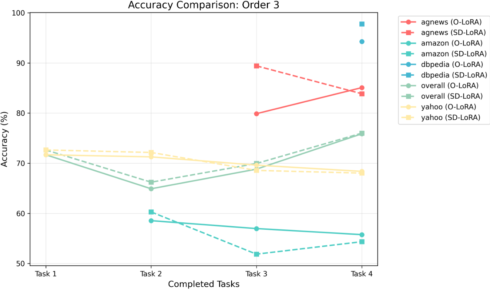
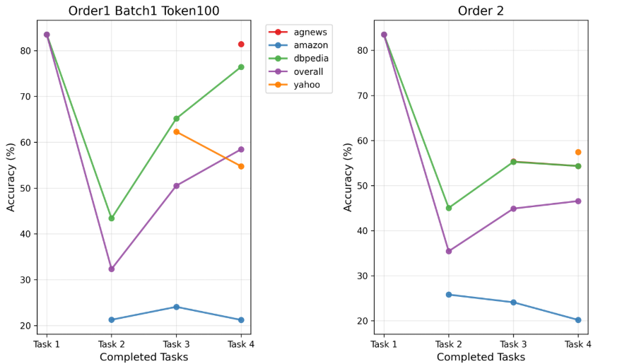

## sdlora forward

forward在`peft/tuners/lora`中。

> 创建peft/tuners/sdlora。
>
> 核心算法

保存和lora合并逻辑在`peft/utils/save_and_load.py`,

o_lora合并是直接把lora_new concate 到lora上

> 修改保存逻辑，单独保存direction。

config.save_loranew控制是否保存lora_new

替换成这样的结构：


historical_scaling(初始化在load里面) :


- 跑一下
  
  任务1 直接忘完了

save 的时候会删除adapter_name, load的时候要加回来


## T5 

| method  | order-1 | order-2 | order-3 |
| ------- | ------- | ------- | ------- |
| o-lora* | 75.4    | 75.7    | 76.3    |
| o-lora  | 74.0724 | 74.227  | 76.9013 |
| sdlora  | 77.4145 | 69.3684 | 77.3224 |


## llama2-7b

| method  | order-1 | order-2 | order-3 |
| ------- | ------- | ------- | ------- |
| o-lora* | 76.8    | 75.7    | 75.7    |
| o-lora  | 74.4803 | 71.9276 | 75.8717 |
| sdlora  | 77.4539 | 79.1349 | 76.0    |




# prompt

infer batchsize != 1 时em=0（一个batch里面task不同）

## token length 的影响

1 epoch

|      | train_loss         | predict loss        | em      |
| ---- | ------------------ | ------------------- | ------- |
| 20   | 0.6724405691964286 | 0.8253757357597351  | 55.3158 |
| 100  | 0.7098203125       | 0.22651955485343933 | 86.1711 |

# l2p


# dual prompt

> 下面结合你仓库中的 dualprompt.py 代码，给出 DualPrompt 的逻辑、细节、对应代码解析、损失函数，以及与 L2P 的差异。
>
> 一、方法逻辑概览
> - 核心思想：同时引入两类提示
>   - G-Prompt（General）：全局共享，跨任务稳定化特征，通常插入多层以提升泛化。
>   - E-Prompt（Expert）：任务专属/实例检索，增强新任务判别能力。
> - 训练流程（models/dualprompt.py）
>   - incremental_train：按任务构建 dataloader，进入 _train。
>   - _train：
>     - 构建优化器/调度器。
>     - 非首任务执行 _init_prompt，初始化当前任务的 E-Prompt 槽位（可从上一任务拷贝继承）。
>     - 如需，重新初始化优化器（reinit_optimizer）。
>     - _init_train：循环 epoch，前向得到 logits 和可选的 reduce_sim，计算损失，优化与评测。
>   - after_task：更新已知类别数。
>
> 二、关键实现与代码细节
> 1) 冻结策略与可训练参数
> - 在 __init__ 中：默认冻结预训练 ViT 主干 original_backbone；可按名称前缀定向冻结 backbone 的子模块（blocks、patch_embed、cls_token 等），只训练提示相关参数与必要头部。
> - 打印总参数与可训练参数，便于核查是否只训练 Prompt。
>
> 2) E-Prompt 池的“替换/继承”与键拷贝
> - 位置分配：每个任务占用连续 top_k 个槽位。任务 t 对应 [t*top_k, (t+1)*top_k)。
> - _init_prompt 中，在共享设置开启时把上一任务的提示复制到当前任务的槽位，实现“继承再微调”；同时可复制 prompt_key：
> ````python
> # 片段摘自 _init_prompt
> # 如果启用了前缀微调形式（prefix-tuning），E-Prompt 形状为 [layers, length, pool_size]，因此用 3 维切片
> cur_idx  = (slice(None), slice(None), slice(cur_start, cur_end)) if args["use_prefix_tune_for_e_prompt"] else (slice(None), slice(cur_start, cur_end))
> prev_idx = (slice(None), slice(None), slice(prev_start, prev_end)) if args["use_prefix_tune_for_e_prompt"] else (slice(None), slice(prev_start, prev_end))
> 
> with torch.no_grad():
>     model.e_prompt.prompt.grad.zero_()
>     model.e_prompt.prompt[cur_idx] = model.e_prompt.prompt[prev_idx]
>     optimizer.param_groups[0]['params'] = model.parameters()
> 
> # 键的继承（用于检索或匹配）
> with torch.no_grad():
>     model.e_prompt.prompt_key.grad.zero_()
>     model.e_prompt.prompt_key[cur_idx_key] = model.e_prompt.prompt_key[prev_idx_key]
>     optimizer.param_groups[0]['params'] = model.parameters()
> ````
> - 作用：
>   - 将上个任务学到的“专家提示”迁移到新任务的专属槽位，减少冷启动，提高收敛速度。
>   - 复制 prompt_key 使检索空间初始化合理。
>
> 3) 前向调用与任务掩码
> - 训练时 Learner 调用 self._network(inputs, task_id=self._cur_task, train=True)。
> - 在骨干网络（PromptVitNet/ViT）内通常会根据 task_id 为 E-Prompt 设置可选的 prompt_mask：训练阶段仅开放当前任务对应的 E-Prompt 槽位；G-Prompt 则为共享提示，在多层注入并参与前向。
>
> 三、损失函数（loss）
> - 在 _init_train 中，DualPrompt 的损失由分类交叉熵和可选的提示相似性约束组成：
> ````python
> # ...existing code...
> output = self._network(inputs, task_id=self._cur_task, train=True)
> logits = output["logits"][:, :self._total_classes]
> logits[:, :self._known_classes] = float('-inf')  # 屏蔽旧类
> 
> loss = F.cross_entropy(logits, targets.long())
> 
> # 可选：提示多样性/拉开相似度约束（由骨干 forward 返回的 reduce_sim 提供）
> if self.args["pull_constraint"] and 'reduce_sim' in output:
>     loss = loss - self.args["pull_constraint_coeff"] * output['reduce_sim']
> # ...existing code...
> ````
> - 含义：
>   - 分类损失：只对当前可见类别训练，避免旧类梯度干扰。
>   - 约束项：鼓励提示之间低相似或提升选中提示的判别性，多用于提升检索质量与多样性。
> - 总体形式：L = L_ce + λ · L_constraint（代码里是减去 coeff·reduce_sim，等价于最小化相似度/最大化区分度）。
>
> 四、DualPrompt 支持的操作/特性
> - 任务专属 E-Prompt 槽位分配与继承（shared_prompt_pool/shared_prompt_key 控制）。
> - 可选前缀式 E-Prompt（use_prefix_tune_for_e_prompt），形状与索引方式不同。
> - G-Prompt（一般在骨干里实现）跨任务共享、层内注入，提升稳定性与可迁移性。
> - 训练时任务掩码约束 E-Prompt 检索范围；推理时可依据实现选择是否放开检索。
> - 冻结主干，仅训练提示与头部，参数高效。
>
> 五、与 L2P 的主要不同
> - 提示形态
>   - L2P：单一提示池（Prompt Pool）+ 实例级检索（top-k），通常按样本内容选择提示。
>   - DualPrompt：双提示设计。G-Prompt 负责跨任务共享稳定化，E-Prompt 负责任务专长；两者协同。
> - 任务约束
>   - L2P：常做实例级池检索；也可用任务掩码。
>   - DualPrompt：训练阶段明确以 task_id 限定 E-Prompt 槽位，减少跨任务干扰；G-Prompt 全局共享。
> - 初始化与继承
>   - L2P：可复制上一任务的池元素，但主要围绕一个共享池。
>   - DualPrompt：显式把“上一任务的 E-Prompt”复制到“当前任务专属槽位”，鼓励“从上个任务的专家知识起步再细化”。
> - 表达能力
>   - DualPrompt 借助 G-Prompt 提供稳定的共享上下文，同时用 E-Prompt 强化新任务专门性，通常在增量场景下更稳。
>
> 六、实践要点
> - 关键参数：top_k、size（池大小）、shared_prompt_pool、shared_prompt_key、use_prefix_tune_for_e_prompt、pull_constraint/pull_constraint_coeff、reinit_optimizer。
> - 注意事项：
>   - 复制提示后更新 optimizer.param_groups[0]['params']，确保新 tensor 被优化器跟踪。
>   - 若使用多 GPU，注意 DataParallel 后 module 访问位置。
>   - 旧类屏蔽仅在训练使用，评测时按需求选择是否屏蔽。
>
> 若你需要我进一步打开 PromptVitNet/backbone 代码，定位 G-Prompt/E-Prompt 的具体注入层与 reduce_sim 的定义，我可以在活动编辑器中查看并逐行解释。
>
> 找到具有 1 个许可证类型的类似代码



|      | order-1 | order-2 | order-3 |
| ---- | ------- | ------- | ------- |
| l2p* | 60.3    | 61.7    | 61.1    |
| l2p  | 58.4507 | 46.5691 |         |

